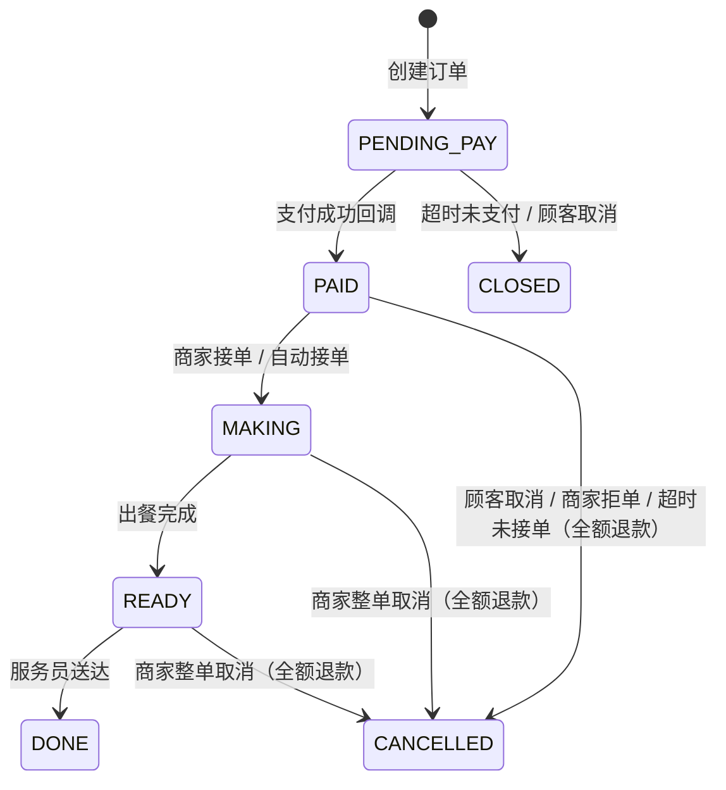
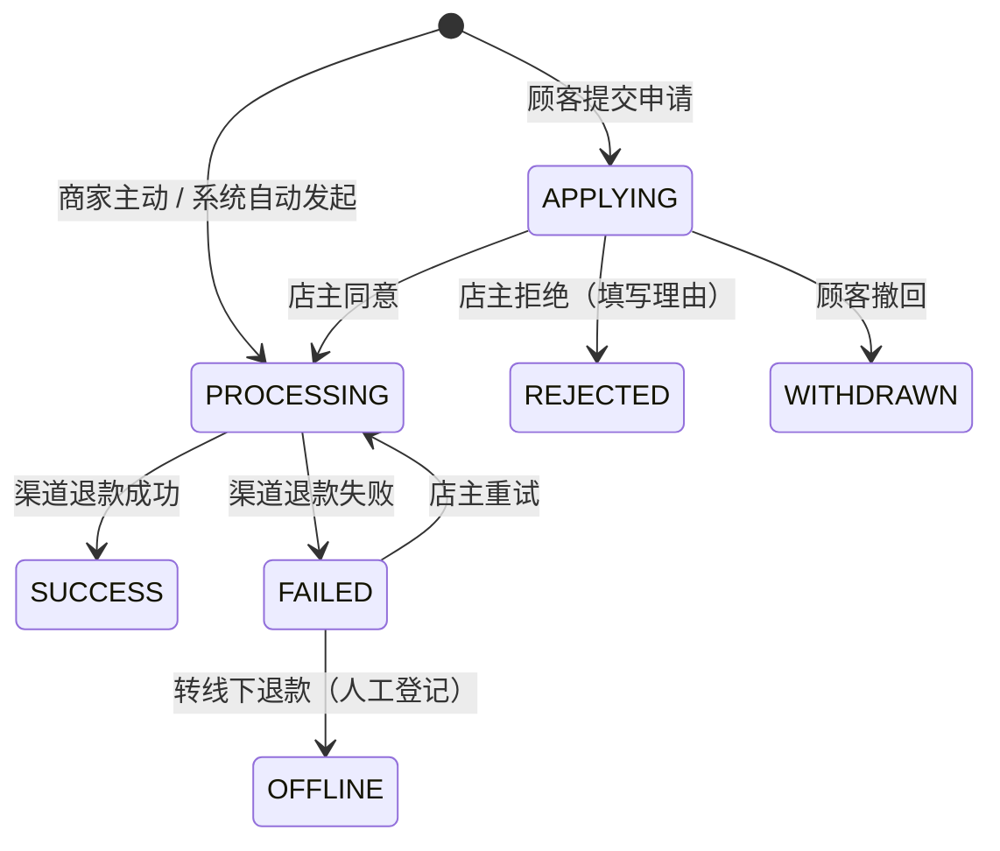

# 个人店面点餐平台 — 需求分析文档

> 版本：v1.2 ｜ 日期：2026-10-04 ｜ 状态：需求基本确认，待第 18 节决策拍板后进入设计阶段

> **⚠️ 本文已过时，仅作历史参考。** 产品在 2026-10-05 之后改为「顾客 H5（浏览器）+ 会员余额支付」，小程序、微信 / 支付宝支付、静默登录、渠道回调等章节不再成立。当前以 [项目架构](项目架构.md) 和 [README](../README.md) 为准。

## 0. 变更记录

| 版本 | 变更内容 |
|---|---|
| v1.0 | 初版：多店连锁、移动端 Web、手机号验证码登录 |
| v1.1 | ① 顾客端改为 **Taro（React）小程序**，支持微信、支付宝两端；② 主体定为**个人店面（个体工商户）**，单一经营主体，MVP 单店；③ **一次下单、一次支付**；④ **完善退款机制**；⑤ 改为小程序静默登录；⑥ 修正数据模型和支付设计 |
| v1.2 | 以 v1.1 为主，合并另一版评审文档中不冲突的内容：明确不做清单、超时与自动规则、库存可选字段、JWT 刷新与失效、多租户插件防越权、统一错误码与分页、流水导出、后厨打印（V1）、运维与测试要求、**验收标准、页面清单、异常流程**。取舍说明见附录 |
| v1.2 补充（2026-10-05） | 普通浏览器扫码可匿名查看菜单、店铺、桌号、规格与加料；完整下单支付仍通过小程序，H5 交易流程后续按需求评估 |

---

## 1. 项目概述

### 1.1 产品定位

面向**个人店面**（个体工商户经营的小型餐饮门店）的堂食扫码点餐平台：顾客到店用微信或支付宝扫桌码 → 小程序内点餐支付 → 商家接单出餐，服务员送餐到桌。

**技术栈**：

| 层 | 选型 | 说明 |
|---|---|---|
| 顾客端 | **Taro 4 + React 18 + TypeScript**，编译为微信小程序和支付宝小程序 | 一套代码，两端构建（`taro build --type weapp / alipay`） |
| 顾客端 UI | NutUI-React（Taro 版）或 Taroify | 选型前需在两端真机验证兼容性 |
| 顾客端状态 / 请求 | Zustand；`Taro.request` 统一封装（拦截器、token 刷新、错误码处理） | 小程序没有浏览器 XHR，Axios 需加适配器，建议直接封装 `Taro.request` |
| 顾客端路由 | Taro 页面配置 + `Taro.navigateTo` | 小程序不使用 React Router |
| 商家端 | React + Vite + Ant Design（桌面 Web 管理后台） | |
| 后端 | Spring Boot（模块化）+ Spring Security + JWT + MyBatis-Plus | |
| 数据库 | PostgreSQL | Redis 在 MVP 阶段可不引入（见第 13 节） |
| 文件存储 | `StorageService` 抽象；MVP 本地存储 + 压缩缩略图，后续可切换 OSS + CDN | 菜品图片不打进小程序包（主包 2MB 限制） |
| 部署 | Docker + docker-compose（Nginx / backend / postgres） | |

**核心链路**：扫码进入小程序 → 静默登录 → 选菜下单 → 小程序内支付 → 商家接单（制作中）→ 出餐 → 服务员送餐 → 完成。

### 1.2 明确不做（防止范围蔓延）

| 事项 | 结论 |
|---|---|
| 套餐（组合售卖） | 不做。最小售卖单位 = 单品 + 规格 + 加料 |
| 发票开具对接 | 不做 |
| 外卖配送 | 不做（专注堂食） |
| 移动端 H5 交易 | 暂不做。H5 支持匿名看菜单、搜索、查看规格与加料；下单支付引导至微信 / 支付宝小程序 |
| SaaS 多商户入驻 | 不做。本系统只服务一个经营主体 |
| 会员、优惠券、营销 | 后续版本 |

---

## 2. 主体资质与上线前置条件（关键路径）

> **“个人店面”在本文中指个体工商户主体。**
> 个人主体（只有身份证、没有营业执照）的小程序**不能开通微信支付**，也不开放餐饮等服务类目，支付宝小程序支付同样要求企业或个体工商户签约。餐饮门店依法本来就需要营业执照和食品经营许可证，按个体工商户主体办理即可，不需要公司资质。

| 序号 | 事项 | 说明 | 预估周期 |
|---|---|---|---|
| 1 | 营业执照（个体工商户）+ 食品经营许可证 | 小程序类目审核和支付签约都要用 | 店主已有则跳过 |
| 2 | 注册微信小程序（个体户主体）+ 微信认证 | 认证有年费；选择“餐饮服务”类目 | 1~2 周 |
| 3 | 注册支付宝小程序（个体户主体） | 在支付宝开放平台创建并完成类目审核 | 1~2 周 |
| 4 | 小程序备案（两端都需要） | 小程序上架前必须完成备案 | 1~3 周 |
| 5 | 微信支付商户号（个体户）并关联小程序 AppID | 开通小程序支付，配置 API v3 密钥和证书 | 1~2 周 |
| 6 | 支付宝签约“小程序支付”产品 | 配置应用公钥/私钥、支付宝公钥 | 数天~1 周 |
| 7 | 域名 + ICP 备案 + HTTPS 证书 | 小程序请求域名白名单、支付回调、桌码链接都要用 | 1~3 周 |
| 8 | 云服务器（国内节点） | 部署后端、数据库、Nginx | 即买即用 |

**事项 2~7 可以并行，必须在开发启动时同步办理，否则会卡住联调和上线。**

---

## 3. 关键决策

| 决策点 | 结论 | 状态 |
|---|---|---|
| 经营主体 | 个人店面（个体工商户），单一经营主体 | 已定 |
| 店铺规模 | MVP **单店**；业务表保留 `store_id`，后续扩展多店不改表结构 | 已定 |
| 经营模式 | 堂食扫码点餐（每桌一码） | 已定 |
| 顾客端形态 | 微信小程序 + 支付宝小程序（Taro 一套代码） | 已定 |
| 支付方式 | 微信小程序内用微信支付，支付宝小程序内用支付宝支付 | 已定 |
| 资金归属 | 一个微信支付商户号 + 一个支付宝账户 | 已定 |
| 订单模式 | **一次下单、一次支付**；加菜即再下一单。桌台会话、合单支付后续再做 | 已定 |
| 顾客登录 | 小程序**静默登录**（取 openid / 支付宝用户 ID），无需短信和手机号 | 已定 |
| 出餐方式 | 后厨制作完成后，服务员送餐到桌 | 已定 |
| 菜品复杂度 | 多规格组（每组单选，按规格加价）+ 加料（可多选，按项加价） | 已定 |
| 金额存储 | 统一用**分**（整数 `BIGINT`） | 已定 |
| 接单模式 | 店铺开关：手动接单（默认）/ 自动接单 | 待拍板 |
| 库存 | MVP 默认布尔沽清；每日限量库存为可选字段 | 待拍板 |
| 图片存储 | MVP 本地存储 + 压缩；OSS + CDN 后续 | 待拍板 |

---

## 4. 角色与权限

| 角色 | 端 | 权限范围 |
|---|---|---|
| 顾客 | 小程序 | 扫码进店、浏览菜品、下单、支付、查看订单状态和历史订单、取消订单、申请退款 |
| 店主（OWNER） | 商家端 | 全部权限：店铺设置、菜品/桌台管理、订单处理、**退款审核与发起**、数据看板、流水导出、员工管理 |
| 店员（STAFF） | 商家端 | 接单、拒单（仅限待接单订单）、标记出餐/送达、菜品沽清、查看订单 |

- MVP 阶段**退款审核和商家主动退款只允许店主操作**（拒单产生的退款除外）。V1 可以增加“店员小额退款权限”，金额阈值由店主配置
- 小店人员少，MVP 不细分收银、后厨、服务员角色；商家端提供“后厨队列视图”，店员按需使用。人员增多后再细分

---

## 5. 功能需求

### 5.1 顾客端（微信 / 支付宝小程序）

| 模块 | 功能点 |
|---|---|
| 登录 | 进入小程序自动静默登录，换取后端 JWT，用户无感知 |
| 隐私 | 首次使用弹出隐私保护指引，同意后才能继续 |
| 扫码进店 | 微信或支付宝扫桌码 → 打开小程序 → 解析出店铺 + 桌号 → 进入点餐页；店铺打烊时提示不可下单 |
| 点餐 | 分类浏览、菜品搜索、菜品详情（图片/价格/描述）、规格选择（每组单选）、加料选择（多选，受上限约束）、购物车、改数量；沽清菜品置灰 |
| 下单 | 备注、就餐人数、确认金额、提交订单 |
| 支付 | 调起本平台支付；支付结果**以后端查询为准**（前端回调只作提示） |
| 订单 | 订单状态跟踪（待支付→待接单→制作中→待送餐→已完成）、历史订单、继续支付、取消订单 |
| 退款 | 申请退款（选择退款菜品/数量、原因）、查看退款进度、撤回申请 |
| 消息 | 订阅消息：接单、出餐、退款结果通知（需用户在下单时授权）（V1） |

### 5.2 商家端（桌面 Web）

| 模块 | 功能点 |
|---|---|
| 登录认证 | 账号密码 + JWT；员工停用后立即失效 |
| 工作台 | 今日概览、新订单实时提醒（声音 + 弹窗）、待处理退款提醒 |
| 店铺设置 | 店铺信息（名称/Logo/电话/地址/营业时间/营业状态）、业务参数（接单模式、未支付关单时长、未接单自动退款时长、售后申请时限） |
| 桌台管理 | 桌号 CRUD、**桌码生成、批量下载与打印**（一码同时支持微信、支付宝扫码）、重置桌码（旧码失效） |
| 菜品管理 | 分类 CRUD、菜品 CRUD（含排序）、规格组/规格项、加料组/加料项（挂在菜品下）、上下架、**沽清/恢复**、每日限量库存（可选）、图片上传 |
| 订单管理 | 订单列表与筛选、接单/拒单、标记出餐/送达、整单取消、订单详情（含支付、退款、状态日志） |
| 后厨队列视图 | 只显示待制作和制作中的订单，大字体，一键出餐 |
| 退款管理 | 退款申请列表、**审核（同意/拒绝）**、主动发起退款（整单/按菜品/自定义金额）、失败重试、登记线下退款 |
| 数据看板 | 今日实收（支付 − 退款）、订单量、退款笔数/金额、菜品销售排行 |
| 流水导出 | **按日期导出 CSV（订单 + 支付 + 退款明细）**，用于人工对账 |
| 员工管理 | 店员账号 CRUD、启用/停用（V1） |
| 后厨打印 | 云打印机，接单后自动打印小票（V1，见 5.3） |

### 5.3 后厨云打印（V1）

- 接入云打印机（如飞鹅、易联云），接单后自动打印小票，可按档口拆单（如热菜、饮品各打一张）
- 打印失败自动重试并在商家端提示；**打印状态和订单状态互不影响**，打印失败不阻塞订单流转
- 支持手动补打
- 退菜、整单取消时打印取消单（可选）

---

## 6. 扫码进店方案（一码双端）

**问题**：微信小程序码不能用支付宝扫，反过来也一样。每桌只贴一个码，就需要两端都能识别。

**方案**：桌码使用**普通 HTTPS 链接二维码**，两端分别配置“扫普通链接二维码打开小程序”。

1. 桌码内容：`https://<域名>/q/<qrToken>`。链接**只带 qrToken**（随机不可猜测串，只对应一张桌台），不带店铺 ID 和桌号
2. 微信公众平台配置“扫普通链接二维码打开小程序”规则；支付宝开放平台配置“关联普通二维码”。两端都要把校验文件放到域名根目录
3. 用微信或支付宝扫码 → 直接打开对应小程序，原始链接作为启动参数传入（微信在 `query.q`，支付宝在 `query.qrCode`），小程序解析出 `qrToken`
4. 用其他 App 或系统相机扫码 → 打开 Nginx 托管的 H5 匿名菜单页，显示店铺、桌号、分类、菜品价格与规格；下单支付提示使用微信或支付宝重新扫描桌码进入小程序
5. 后端 `GET /api/v1/c/qr/{qrToken}` 返回店铺 + 桌台信息；无效或已重置的 token 返回明确错误
6. 下单接口按用户和 IP 限流，防止有人拿到桌码后远程恶意下单

> 注意：微信的普通二维码规则需要小程序已发布才全量生效，开发阶段使用平台提供的测试链接调试。

---

## 7. 核心业务流程

### 7.1 堂食扫码点餐流程

1. 顾客落座，用微信或支付宝扫桌码 → 打开小程序，自动静默登录，解析店铺 + 桌号
2. 浏览菜品 → 选择规格/加料 → 加购 → 提交订单。后端**重新计算价格**并校验，订单进入**待支付**（默认 15 分钟有效）
3. 调起支付 → 渠道异步回调 → 验签 + 校验金额 → 订单置为**待接单**（PAID）；开启自动接单时直接进入制作中
4. 商家端收到新订单提醒 → 店员接单 → **制作中**
5. 出餐完成 → **待送餐**
6. 服务员按桌号送餐 → 标记**已完成**
7. 顾客如需加菜，再下一单，走同样的流程

### 7.2 订单状态机

| 状态 | 含义 | 顾客端展示 |
|---|---|---|
| `PENDING_PAY` | 待支付 | 待支付（显示倒计时） |
| `PAID` | 已支付，待商家接单 | 待接单 |
| `MAKING` | 已接单，制作中 | 制作中 |
| `READY` | 已出餐，待送餐 | 待送餐 |
| `DONE` | 已送达 | 已完成 |
| `CLOSED` | 未支付关闭，没有资金往来 | 已关闭 |
| `CANCELLED` | 已支付后取消，伴随全额退款 | 已取消（退款中 / 已退款） |

**订单状态和退款状态是两个独立维度**：

- `orders.status` 表示履约进度（上表）
- `orders.refund_status` 表示资金退还情况：`NONE`（无退款）/ `PARTIAL`（部分退款）/ `FULL`（全额退款）
- 部分退款（如退一道菜）**不改变订单状态**，只更新 `refund_status`；已完成订单发生售后退款，订单状态仍为 `DONE`
- 订单进入 `CANCELLED` 时立即停止后厨制作，退款异步进行，结果体现在 `refund_status` 和退款单上
- 不单独设“退款中”订单状态，避免和履约状态混在一起；“退款中”由退款单状态表达
- 每次状态变更都写入 `order_status_log`

### 7.3 超时与自动规则

| 场景 | 规则（默认值，店铺可配置） |
|---|---|
| 待支付超时 | 15 分钟自动关闭，同时调用渠道关单接口；关闭后不可再支付 |
| 自动接单 | 开启后，支付成功即进入制作中 |
| 手动接单超时 | 已支付 10 分钟未接单 → 自动取消并全额退款，同时提醒店主 |
| 迟到的支付回调 | 订单已关闭但支付成功回调到达 → 自动全额退款 |
| 回调丢失补偿 | 定时任务对待支付订单主动查单，按渠道真实结果更新 |
| 退款结果补偿 | 定时任务对处理中超过 N 分钟的退款单主动查询 |
| 售后时限 | 下单后 24 小时内可申请售后退款 |
| 退款审核提醒 | 顾客申请 2 小时未处理 → 再次提醒店主（不自动同意） |

---

## 8. 退款机制

### 8.1 退款场景矩阵

| 订单阶段 | 场景 | 发起方 | 是否需审核 | 退款范围 |
|---|---|---|---|---|
| 待接单（PAID） | 顾客自助取消 | 顾客 | 否，自动退款 | 全额 |
| 待接单（PAID） | 商家拒单（如忙不过来、菜品做不了） | 店员 / 店主 | 否 | 全额 |
| 待接单（PAID） | 超时未接单 | 系统 | 否 | 全额 |
| 制作中 / 待送餐 | 顾客申请取消整单或退部分菜品 | 顾客 | **是**，店主审核 | 全额 / 部分 |
| 制作中 / 待送餐 | 某道菜缺料做不了 | 店主 | 否 | 部分（按菜品） |
| 制作中 / 待送餐 | 商家整单取消 | 店主 | 否 | 全额 |
| 已完成（DONE） | 售后：菜品有问题、上错菜等（售后时限内） | 顾客申请 / 店主主动 | 顾客申请需审核 | 部分 / 全额 |
| 已关闭（CLOSED） | 关单后支付回调才到达 | 系统 | 否 | 全额（异常退款） |
| 任意 | 同一订单出现两笔成功支付（重复支付） | 系统 | 否 | 多出的那一笔全额 |

### 8.2 退款方式

| 方式 | 说明 | 计算规则 |
|---|---|---|
| 整单全额退 | 退回该订单全部未退金额 | 退款金额 = 实付 − 已退成功 − 退款处理中 |
| 按菜品退 | 选择明细行和数量 | 退款金额 = Σ（明细单价 × 退款数量）；累计退款数量不能超过购买数量 |
| 自定义金额退 | 仅店主可用，用于售后补偿（如菜品有问题退一半） | 必须填写原因；金额不能超过可退余额 |

### 8.3 业务规则

1. **可退余额**：`可退余额 = 实付金额 − Σ成功退款 − Σ处理中退款`，任何退款都不能超过可退余额
2. **同一订单同一时间只允许一笔退款处于“待审核/处理中”**，用订单行锁或乐观锁保证，避免并发超退
3. **时限**：售后申请时限由店铺配置；渠道本身也有可退期限，以微信支付、支付宝的签约约定为准
4. **审核**：顾客申请提交后通知店主；店主拒绝时必须填写理由，顾客可以看到；审核超时再次提醒，不自动同意
5. **权限**：拒单退款店员可操作；审核、主动部分退款、自定义金额退款、整单取消只有店主可操作；所有退款操作记录操作人
6. **原路退回**：退款原路退回顾客的微信零钱/支付宝账户（或原支付卡），不支持退到其他账户
7. **库存回补**（启用每日限量库存时）：未支付关闭、待接单阶段取消时回补库存；已开始制作后的退款不回补
8. **通知**：退款成功或失败、申请被拒绝时通知顾客（V1 订阅消息；MVP 在订单页展示）

### 8.4 退款单状态机

| 状态 | 含义 |
|---|---|
| `APPLYING` | 顾客申请，待店主审核 |
| `PROCESSING` | 已向渠道提交退款，等待结果 |
| `SUCCESS` | 渠道确认退款成功（终态） |
| `FAILED` | 渠道退款失败（如商户号余额不足、交易超过可退期限） |
| `REJECTED` | 店主拒绝（终态） |
| `WITHDRAWN` | 顾客撤回（终态） |
| `OFFLINE` | 线上退款无法完成，店主线下退给顾客并登记凭证（终态，计入已退金额） |

**和订单的联动**：退款单变为 `SUCCESS` 或 `OFFLINE` 时，累加 `payment.refunded_amount`、`orders.refunded_amount` 和 `order_item.refunded_qty`，并重新计算 `orders.refund_status`（累计退款 = 实付 → `FULL`，否则 `PARTIAL`）。

### 8.5 渠道交互与可靠性

| 要点 | 设计 |
|---|---|
| 幂等 | 每笔退款生成唯一的**商户退款单号**（即 `refund.refund_no`，微信对应 `out_refund_no`，支付宝对应 `out_request_no`）。重试沿用同一个单号，渠道不会重复退款 |
| 微信退款结果 | 调用退款申请接口后，以**退款结果异步通知**为准（`/api/v1/pay/notify/wechat-refund`），通知需要验签和解密 |
| 支付宝退款结果 | 退款接口同步返回结果；返回不明确时调用退款查询接口确认 |
| 补偿查询 | 定时任务扫描处理中超时的退款单，主动向渠道查询 |
| 余额不足 | 微信退款优先扣未结算资金，不够再扣商户号余额，余额不足会失败。此时标记 `FAILED` 并提醒店主充值后重试 |
| 部分退款次数 | 渠道对单笔交易的部分退款次数有上限；业务上同一时刻只允许一笔，正常情况不会触及 |
| 审计 | 退款单记录发起方、操作人、原因、渠道请求和响应摘要 |

---

## 9. 数据模型

### 9.1 设计约定

- 所有表包含 `id`（BIGSERIAL 主键）、`created_at`、`updated_at`；需要软删除的表包含 `deleted`（MyBatis-Plus `@TableLogic`）；订单、支付、退款、库存相关表包含 `version`（乐观锁）
- 所有业务表包含 `store_id`（MVP 只有一家店，为后续多店预留），并通过 MyBatis-Plus 多租户插件自动追加过滤条件
- 金额字段统一使用 `BIGINT`，单位为分，展示层再转换
- `table` 是 PostgreSQL 保留字，桌台表命名为 `dining_table`
- 顾客和员工**分表存储**，两套账号体系互不影响
- 订单、支付、退款的状态变更一律使用**条件更新**（带 status / version 条件）

### 9.2 菜品 SKU 与计价

`dish` 存基础价，规格和加料均为“基础价 + 加价”的增量模型：

`unit_price = dish.price + Σ所选规格项.price_delta + Σ所选加料项.price_delta`

下单时由**后端计算**并写入订单明细快照，不信任前端传来的价格。

示例：奶茶基础价 1200 分；规格组“杯型”选大杯 +300；加料组“小料”选珍珠 +200 → 单价 1700 分（¥17）。

**下单校验**：

- 菜品已上架且未沽清
- 规格项和加料项属于该菜品；必选规格组已选且只选一项；加料数量不超过 `max_count`
- 店铺处于营业状态，桌台有效
- 启用每日限量库存时，用条件更新扣减：`UPDATE dish SET stock_quantity = stock_quantity - ? WHERE id = ? AND stock_quantity >= ?`，影响 0 行即提示售罄

### 9.3 表结构（17 张）

| 表 | 关键字段 | 说明 |
|---|---|---|
| `store` | id, name, logo, phone, address, business_status, business_hours, auto_accept, pay_timeout_min, accept_timeout_min, after_sale_hours | 门店及业务参数 |
| `customer` | id, nickname, avatar, phone(可空), status | 顾客 |
| `customer_auth` | id, customer_id, platform(WECHAT/ALIPAY), open_id, union_id | 小程序身份；`platform + open_id` 唯一 |
| `staff` | id, store_id, username, password_hash, name, role(OWNER/STAFF), status, token_version | 商家员工账号；`token_version` 用于让旧 token 失效 |
| `category` | id, store_id, name, sort, status | 菜品分类 |
| `dish` | id, store_id, category_id, name, description, price, image, sort, status(上/下架), is_sold_out, stock_quantity(可空) | 菜品；`stock_quantity` 为空表示不限量 |
| `dish_spec_group` | id, dish_id, name, required, sort | 规格组（组内单选） |
| `dish_spec_item` | id, group_id, name, price_delta, is_default, sort | 规格项 |
| `addon_group` | id, dish_id, name, max_count, sort | 加料组（可多选） |
| `addon_item` | id, group_id, name, price_delta, sort | 加料项 |
| `dining_table` | id, store_id, code, qr_token, status | 桌台；`qr_token` 唯一且可重置 |
| `orders` | id, order_no, store_id, table_id, customer_id, platform, status, refund_status, total_amount, pay_amount, refunded_amount, people_count, remark, pay_expire_at, paid_at, accepted_at, ready_at, done_at, cancelled_at, cancel_reason, version | 订单主表 |
| `order_item` | id, order_id, dish_id, dish_name, dish_image, spec_item_ids, addon_item_ids, spec_desc, addon_desc, unit_price, quantity, total_price, refunded_qty | **明细快照**（名称、单价、所选项 ID 落库）；`refunded_qty` 用于按菜品退款 |
| `payment` | id, order_id, out_trade_no, channel(WECHAT/ALIPAY), transaction_no, amount, status(PENDING/SUCCESS/CLOSED), paid_at, refunded_amount | 支付记录；订单 1:N；`out_trade_no` 唯一，作幂等键 |
| `refund` | id, refund_no, order_id, payment_id, type(FULL/ITEM/CUSTOM), initiator(CUSTOMER/MERCHANT/SYSTEM), amount, reason, reject_reason, status, channel_refund_no, operator_id, success_at, fail_reason, version | 退款单；`refund_no` 唯一，作为渠道的商户退款单号 |
| `refund_item` | id, refund_id, order_item_id, quantity, amount | 按菜品退款的明细 |
| `order_status_log` | id, order_id, from_status, to_status, operator_type, operator_id, remark | 订单状态流转日志 |

### 9.4 核心关系

- `store` 1:N `category` / `dish` / `dining_table` / `staff` / `orders`
- `customer` 1:N `customer_auth`；`customer` 1:N `orders`
- `dish` 1:N `dish_spec_group` 1:N `dish_spec_item`；`dish` 1:N `addon_group` 1:N `addon_item`
- `orders` 1:N `order_item`；`orders` 1:N `payment`；`orders` 1:N `refund` 1:N `refund_item`
- `orders` 1:N `order_status_log`

### 9.5 关键索引与约束

- 唯一：`orders.order_no`、`payment.out_trade_no`、`payment(channel, transaction_no)`（非空时）、`refund.refund_no`、`customer_auth(platform, open_id)`、`dining_table.qr_token`、`staff.username`
- 查询索引：`orders(store_id, status, created_at)`、`orders(customer_id, created_at)`、`refund(store_id, status)`、`dish(store_id, category_id)`

---

## 10. 登录、鉴权与支付

### 10.1 小程序静默登录

| 端 | 流程 |
|---|---|
| 微信 | `Taro.login()` 取 code → 后端调用 `code2Session` 换 openid → 查找或创建 `customer` → 签发 JWT |
| 支付宝 | `my.getAuthCode({ scopes: 'auth_base' })` 取 authCode → 后端调用 `alipay.system.oauth.token` 换支付宝用户 ID → 查找或创建 `customer` → 签发 JWT |

- 两端通过 `process.env.TARO_ENV`（`weapp` / `alipay`）做条件分支
- 同一个人在微信和支付宝上是两个独立顾客，MVP 不做打通
- 获取手机号放到后续版本（微信手机号快速验证组件需认证且按次收费，支付宝获取手机号需单独申请）
- 顾客 token 过期后小程序自动重新静默登录，无需刷新 token

### 10.2 商家端鉴权

- 账号密码登录，密码用 BCrypt 存储；连续输错锁定一段时间
- access token 2 小时 + refresh token 14 天
- 员工停用或修改密码时，`staff.token_version` 加 1，旧 token 立即失效（每次请求校验 `token_version` 和员工状态）

### 10.3 Token 隔离与越权防护

- 顾客 JWT 和员工 JWT 使用不同的 audience（`customer` / `merchant`），顾客 token 不能调用 `/api/v1/m`，员工 token 不能调用 `/api/v1/c`
- 商家接口按当前员工所属门店过滤数据，订单、退款单按 `store_id` 校验归属；顾客只能访问自己的订单和退款单
- 使用 MyBatis-Plus 多租户插件按 `store_id` 自动过滤，避免漏写条件

### 10.4 支付

- **渠道抽象**：`PayService` 接口 + `WechatPayServiceImpl` / `AlipayServiceImpl`，封装下单、查单、关单、退款、退款查询、回调验签
- **微信**：后端调用 JSAPI 下单（需要 openid）→ 返回签名参数 → 小程序调用 `Taro.requestPayment`
- **支付宝**：后端调用 `alipay.trade.create`（需要支付宝用户 ID）→ 返回 `trade_no` → 小程序调用 `my.tradePay`
- **支付结果**：以渠道异步回调为准；回调处理时 **验签 → 校验金额 → 条件更新** `UPDATE orders SET status='PAID' WHERE id=? AND status='PENDING_PAY'`，影响 0 行视为重复或异常
- **幂等**：以 `out_trade_no` 为幂等键，重复回调直接返回成功；`transaction_no` 加唯一约束兜底
- **补偿**：前端支付返回后轮询订单状态；回调长时间未到时后端主动查单（见 7.3）
- **回调地址**（公网 HTTPS）：`/api/v1/pay/notify/wechat`、`/api/v1/pay/notify/alipay`、`/api/v1/pay/notify/wechat-refund`

---

## 11. API 清单

### 11.1 通用规范

- 路径前缀：`/api/v1/`
- 统一响应：`{ code, message, data }`
- 分页：请求参数 `page` / `pageSize`，返回 `{ list, total, page, pageSize }`
- 错误码：

| 错误码 | 含义 |
|---|---|
| `0` | 成功 |
| `40101` | 未登录或 token 失效 |
| `40301` | 无权限 |
| `40401` | 资源不存在 |
| `40901` | 状态冲突（如订单已接单不能取消） |
| `40902` | 该订单已有退款在处理中 |
| `42201` | 参数不合法（如必选规格未选） |
| `42202` | 退款金额超过可退余额 |
| `42901` | 请求过于频繁 |
| `50001` | 支付渠道调用失败 |
| `50002` | 退款渠道调用失败 |
| `60001` | 菜品已售罄 / 库存不足 |
| `60002` | 店铺已打烊 |

### 11.2 顾客端 `/api/v1/c`

| 方法 | 路径 | 说明 |
|---|---|---|
| POST | `/api/v1/c/auth/login` | 静默登录（platform + code） |
| GET | `/api/v1/c/qr/{qrToken}` | 扫码解析，返回店铺 + 桌台 |
| GET | `/api/v1/c/stores/{storeId}` | 店铺信息（含营业状态） |
| GET | `/api/v1/c/stores/{storeId}/menu` | 完整菜单：分类 + 菜品 + 规格 + 加料 + 沽清状态 |
| POST | `/api/v1/c/orders` | 创建订单（items: dishId + specItemIds[] + addonItemIds[] + qty；带客户端请求 ID 防重复提交） |
| POST | `/api/v1/c/orders/{orderNo}/pay` | 发起支付，返回拉起参数 |
| GET | `/api/v1/c/orders/{orderNo}` | 订单详情（含状态、支付、退款） |
| GET | `/api/v1/c/orders` | 历史订单 |
| POST | `/api/v1/c/orders/{orderNo}/cancel` | 取消订单：待支付则关闭；待接单则自动全额退款 |
| POST | `/api/v1/c/orders/{orderNo}/refunds` | 申请退款（整单或按菜品 + 原因） |
| GET | `/api/v1/c/orders/{orderNo}/refunds` | 退款进度 |
| POST | `/api/v1/c/refunds/{refundNo}/withdraw` | 撤回退款申请 |

### 11.3 渠道回调（公网）

| 方法 | 路径 | 说明 |
|---|---|---|
| POST | `/api/v1/pay/notify/wechat` | 微信支付结果通知 |
| POST | `/api/v1/pay/notify/alipay` | 支付宝支付结果通知 |
| POST | `/api/v1/pay/notify/wechat-refund` | 微信退款结果通知 |

### 11.4 商家端 `/api/v1/m`

| 方法 | 路径 | 说明 |
|---|---|---|
| POST | `/api/v1/m/auth/login` | 员工登录 |
| POST | `/api/v1/m/auth/refresh` | 刷新 token |
| GET / PUT | `/api/v1/m/store` | 店铺信息与业务参数 |
| CRUD | `/api/v1/m/categories` | 分类管理 |
| CRUD | `/api/v1/m/dishes` | 菜品管理（规格组、加料组随菜品一起保存） |
| PATCH | `/api/v1/m/dishes/{id}/status` | 上下架 |
| PATCH | `/api/v1/m/dishes/{id}/sold-out` | 沽清 / 恢复 |
| PUT | `/api/v1/m/dishes/{id}/stock` | 设置每日限量库存（可选） |
| POST | `/api/v1/m/files/upload` | 图片上传 |
| CRUD | `/api/v1/m/tables` | 桌台管理 |
| GET | `/api/v1/m/tables/qrcodes?ids=` | 批量下载桌码（图片打包） |
| POST | `/api/v1/m/tables/{id}/reset-qr` | 重置桌码 |
| GET | `/api/v1/m/orders?status=&page=&pageSize=` | 订单列表 |
| GET | `/api/v1/m/orders/{orderNo}` | 订单详情 |
| GET | `/api/v1/m/orders/new-count?since=` | 新订单轮询（MVP 实时提醒） |
| POST | `/api/v1/m/orders/{orderNo}/accept` | 接单（进入制作中） |
| POST | `/api/v1/m/orders/{orderNo}/reject` | 拒单（全额退款） |
| POST | `/api/v1/m/orders/{orderNo}/ready` | 出餐完成 |
| POST | `/api/v1/m/orders/{orderNo}/deliver` | 送达完成 |
| POST | `/api/v1/m/orders/{orderNo}/cancel` | 整单取消（店主，全额退款） |
| GET | `/api/v1/m/refunds?status=` | 退款单列表 |
| POST | `/api/v1/m/orders/{orderNo}/refunds` | 商家主动退款（整单 / 按菜品 / 自定义金额） |
| POST | `/api/v1/m/refunds/{refundNo}/approve` | 同意退款申请 |
| POST | `/api/v1/m/refunds/{refundNo}/reject` | 拒绝退款申请（必填理由） |
| POST | `/api/v1/m/refunds/{refundNo}/retry` | 失败重试 |
| POST | `/api/v1/m/refunds/{refundNo}/offline` | 登记线下退款 |
| GET | `/api/v1/m/dashboard/today` | 今日实收、订单量、退款、菜品排行 |
| GET | `/api/v1/m/reports/export?from=&to=` | 流水导出（CSV：订单 + 支付 + 退款） |
| CRUD | `/api/v1/m/staff` | 员工管理（V1） |

---

## 12. 非功能需求

| 类别 | 要求 |
|---|---|
| 性能 | 单店高峰按 50 并发设计；下单、支付接口 P95 < 500ms，其他接口 P95 < 300ms；点餐页首屏 < 2s（4G）；菜单接口可缓存，菜品变更时失效 |
| 安全 | 两套 JWT 隔离 + `token_version` 失效；支付和退款回调验签；金额服务端计算；`qr_token` 随机且可重置；下单、退款申请接口限流；SQL 注入 / XSS 防护；日志中手机号、openid 脱敏；退款等敏感操作记录审计日志 |
| 并发与一致性 | 订单、支付、退款状态变更用条件更新或乐观锁；退款按订单加锁，同一时刻只有一笔进行中；支付和退款按商户单号幂等；创建订单按客户端请求 ID 防重复提交 |
| 可靠性 | 定时任务：未支付关单、未接单自动退款、支付和退款结果补偿查询；回调丢失时通过查单恢复 |
| 实时性 | 商家端 MVP 轮询（3~5 秒）+ 提示音；V1 改为 WebSocket / SSE（需配置 Nginx 升级头和长连接超时）。提示音受浏览器自动播放策略限制，员工登录后需点击一次开启 |
| 兼容性 | 微信、支付宝两端最低基础库版本在开发阶段确定；iOS / Android 真机测试；商家端支持 Chrome / Edge 最新两个版本 |
| 小程序约束 | 请求、上传域名加入白名单且为 HTTPS；主包不超过 2MB，图片走服务端；两端分别提交审核 |
| 合规 | 配置小程序用户隐私保护指引；只收集必要信息；支付和退款记录长期留存 |

---

## 13. 工程、部署与测试

| 项 | 要求 |
|---|---|
| 架构 | Nginx（商家端静态资源 + 桌码 H5 落地页 + 图片静态访问 + API 反向代理 + TLS）｜ backend（Spring Boot，内置定时任务）｜ postgres（卷挂载持久化） |
| Redis | MVP 不引入：限流用本地缓存，定时任务单实例运行；需要多实例部署时再引入 Redis（分布式锁、限流） |
| 图片存储 | `StorageService` 抽象；MVP 本地存储（Docker 卷）+ 上传时压缩并生成缩略图；切换 OSS + CDN 只需替换实现 |
| 环境 | dev / test / prod 三套配置（compose + override 文件）；小程序区分体验版和正式版，对应不同后端地址 |
| CI/CD | GitHub Actions 构建后端镜像和商家端静态包 → 推送镜像仓库 → 服务器拉取更新；小程序用各平台 CLI 上传体验版 |
| 密钥管理 | 支付证书、API 密钥通过环境变量或挂载文件注入，不进代码仓库和镜像 |
| HTTPS | Let's Encrypt 证书自动续期 |
| 备份 | PostgreSQL 每日 `pg_dump`，保留 7 天以上，定期做恢复演练 |
| 日志与监控 | 结构化日志；监控接口可用性、支付失败率、退款失败、定时任务异常，异常时告警到店主或开发者 |
| 测试 | 后端接口测试（MockMvc + Testcontainers）；支付和退款**用真实商户号小额测试**（微信支付没有好用的沙箱）；核心流程手工用例：下单 → 支付 → 接单 → 出餐 → 送达 → 各类退款，微信和支付宝两端各跑一遍 |

---

## 14. 验收标准（核心用户故事）

**US-1 扫码进店**
- AC1：用微信扫桌码打开微信小程序，用支付宝扫同一个码打开支付宝小程序，均能显示正确的店铺和桌号
- AC2：用其他 App 扫码可匿名浏览菜单、搜索菜品和查看规格；打烊仍可浏览，失效桌码和网络异常有明确提示；下单支付引导至微信 / 支付宝小程序
- AC3：桌码重置后，旧码扫码提示“桌码已失效”
- AC4：店铺打烊时可以浏览菜单，但不能下单

**US-2 下单与支付**
- AC1：服务端按“基础价 + 规格加价 + 加料加价”重新计算金额，订单金额以服务端为准
- AC2：必选规格未选、加料超过上限、菜品沽清或下架、店铺打烊，均拒绝下单并给出原因
- AC3：网络重试导致的重复提交只生成一笔订单
- AC4：支付回调验签和金额校验都通过才置为已支付；重复回调不重复入账
- AC5：待支付 15 分钟后自动关闭；关闭后才到达的支付回调触发自动全额退款
- AC6：开启自动接单时，支付成功后订单直接进入制作中

**US-3 订单履约**
- AC1：新订单在 5 秒内出现在商家端并有提示音
- AC2：接单、出餐、送达后，顾客端订单状态同步更新
- AC3：每次状态变更都能在订单详情中看到操作人和时间

**US-4 退款**
- AC1：待接单订单顾客取消后，无需商家操作即自动全额退款，订单变为已取消
- AC2：制作中订单顾客申请退一道菜，店主同意后按该菜品金额退款，订单状态不变，`refund_status` 变为部分退款
- AC3：同一订单已有退款在处理中时，再次申请返回 `40902`
- AC4：退款金额超过可退余额时返回 `42202`
- AC5：退款失败后可重试，重试使用同一退款单号，不会重复退款
- AC6：店员不能审核退款或发起自定义金额退款
- AC7：超过售后时限后，顾客端不再显示“申请退款”入口

**US-5 权限与安全**
- AC1：顾客 token 调用商家接口、员工 token 调用顾客接口，均返回 `40301`
- AC2：顾客无法查看他人的订单和退款单
- AC3：员工被停用后，已登录的会话在下一次请求时返回 `40101`

**US-6 后厨打印（V1）**
- AC1：接单后按档口自动打印小票
- AC2：打印失败自动重试并提示，订单流转不受影响

> 其余功能在设计阶段按同样格式补齐。

---

## 15. 页面清单

**顾客端（小程序）**

| 页面 | 说明 |
|---|---|
| 点餐首页 | 店铺信息、桌号、左侧分类栏 + 右侧菜品列表、底部购物车栏 |
| 菜品详情 / 规格弹窗 | 图片、描述、规格单选、加料多选、数量 |
| 购物车 / 订单确认页 | 明细、就餐人数、备注、应付金额 |
| 支付结果页 | 查询后端状态后展示结果 |
| 订单详情页 | 状态进度、明细、支付信息、退款记录、取消/申请退款入口 |
| 申请退款页 | 选择菜品和数量、原因 |
| 我的订单 | 历史订单列表 |
| 匿名菜单（H5） | 普通浏览器扫码查看店铺、桌号、菜单、规格和加料；引导小程序下单支付 |

**商家端（桌面 Web）**

| 页面 | 说明 |
|---|---|
| 登录页 | |
| 工作台 | 今日概览、新订单提醒、待处理退款 |
| 订单列表 / 详情 | 按状态筛选，详情含支付、退款、状态日志 |
| 后厨队列视图 | 待制作 / 制作中订单，大字体 |
| 退款管理 | 待审核、处理中、失败等分组 |
| 菜品管理 | 分类、菜品、规格、加料、沽清、库存 |
| 桌台管理 | 桌台列表、桌码下载打印、重置 |
| 店铺设置 | 基本信息、营业状态、业务参数 |
| 数据看板 / 流水导出 | |
| 员工管理（V1） | |

> 低保真线框图在设计阶段补充。

---

## 16. 异常流程

| 场景 | 处理 |
|---|---|
| 断网或请求失败 | 下单请求带客户端请求 ID，可安全重试；支付结果页主动查询订单状态 |
| 支付中途退出 | 订单保持待支付，可在订单详情继续支付；超时自动关闭 |
| 重复扫码 | 同一桌码重复扫码直接进入点餐页，不影响已有订单 |
| 下单后菜品被沽清 | 已支付订单不受影响；店主可对该菜品发起按菜品退款 |
| 营业中途打烊 | 拒绝新订单；已支付订单继续履约 |
| 支付回调丢失 | 定时任务主动查单补偿 |
| 关单与支付回调竞态 | 迟到的成功回调触发自动全额退款 |
| 同一订单重复支付 | 保留第一笔，其余自动全额退款 |
| 退款失败（余额不足等） | 标记失败并提醒店主，可重试或登记线下退款 |
| 退款结果迟迟未返回 | 定时任务主动查询退款结果 |
| 打印失败（V1） | 自动重试并提示，可手动补打 |

---

## 17. 里程碑规划

| 阶段 | 范围 | 预估 |
|---|---|---|
| **P0 前置** | 第 2 节的资质、小程序注册与备案、商户号、域名备案（和开发并行） | 2~4 周（关键路径） |
| **MVP** | 单店闭环：两端小程序（静默登录、扫码、点餐、支付、订单、取消与退款申请）、商家端（菜品/桌台/订单/退款管理、后厨队列视图、数据看板、流水导出）、完整退款流程、定时任务 | 4~5 周 |
| **V1** | 后厨云打印、订阅消息、员工管理、店员小额退款权限、WebSocket 实时推送、售后申请上传图片 | +2 周 |
| **V2** | 见第 19 节后续扩展场景 | 按需 |

---

## 18. 待拍板决策

| # | 决策 | 推荐默认 | 影响 |
|---|---|---|---|
| 1 | 接单模式 | 店铺开关，默认手动接单；手动接单超时 10 分钟自动退款 | 订单流转、超时任务 |
| 2 | 超时参数 | 未支付 15 分钟关单；未接单 10 分钟自动退款；售后 24 小时 | 店铺默认配置 |
| 3 | 每日限量库存 | MVP 只用布尔沽清，库存字段预留但默认不启用 | 下单扣减和退款回补逻辑 |
| 4 | 图片存储 | MVP 本地存储 + 压缩；OSS + CDN 后续 | 部署方式 |
| 5 | 店员退款权限 | MVP 仅店主；V1 增加小额阈值授权 | 权限设计 |
| 6 | 后厨打印 | V1 接入；若店主强需求可提前到 MVP（约 +3 天） | MVP 范围 |
| 7 | UI 组件库 | 搭建骨架时用两端真机验证 NutUI-React 和 Taroify 后确定 | 前端开发效率 |

---

## 19. 后续扩展场景（暂不做）

| 场景 | 说明 | 对现有设计的影响 |
|---|---|---|
| 桌台会话 / 加菜合并 | 同一桌同一餐多次下单归到一起，同桌共享购物车，开台/清台 | 新增 `table_session` 表，订单关联会话 |
| 先吃后付 / 合单支付 | 用餐结束后一次结清 | 支付从订单维度提升到会话维度 |
| 费用项 | 餐位费、茶位费、服务费、最低消费 | 订单增加费用明细，退款需明确费用是否可退 |
| 呼叫服务员 / 催单 | 顾客在小程序内发起 | 新增呼叫记录和商家端提醒 |
| 多店 | 一个店主管理多家门店，菜单模板下发 | 表已有 `store_id`；增加员工-门店多对多和门店切换 |
| 手机号绑定 | 跨平台识别同一顾客，作为会员体系基础 | `customer.phone` 已预留 |
| 会员、优惠券、营销 | 储值、满减、折扣 | 订单增加优惠明细，退款需按优惠分摊计算 |
| 自动对账 | 下载渠道对账单并逐笔核对 | 与 `payment`、`refund` 比对 |
| 外带 / 自提 | 不依赖桌台的下单方式 | `orders.table_id` 可空，增加取餐号 |

---

## 20. 下一步建议

1. 立即启动第 2 节的资质和账号办理（关键路径）
2. 拍板第 18 节的决策
3. 数据库 DDL：17 张表的建表 SQL（含索引、唯一约束）
4. 后端工程骨架：Spring Boot 多模块（auth / store / dish / order / payment / refund / stats）+ 双 JWT 体系 + 多租户插件 + 定时任务
5. 前端工程骨架：Taro 双端小程序（先验证扫码启动参数、登录、支付三处条件分支）+ 商家端 Vite 应用
6. 设计阶段补齐全部用户故事验收标准和低保真线框图

---

## 附录：与参考文档的取舍说明

**采纳的内容**

| 内容 | 落在本文 |
|---|---|
| 明确不做清单（套餐、发票对接、外卖） | 1.2 |
| 超时与自动规则汇总 | 7.3 |
| 每日限量库存作为可选字段，条件更新扣减 | 9.2、9.3、18 |
| 订单明细快照保存所选规格/加料 ID | 9.3 |
| access + refresh token、员工停用即失效 | 10.2 |
| MyBatis-Plus 多租户插件防越权 | 9.1、10.3 |
| 统一错误码、分页格式、`/api/v1` 前缀 | 11.1 |
| 流水导出 CSV、批量下载桌码、刷新 token 接口 | 5.2、11.4 |
| 后厨云打印（按档口拆单、打印与订单解耦） | 5.3（放 V1） |
| 本地存储 + `StorageService` 抽象，Redis 后置 | 13 |
| 运维（证书续期、备份与恢复演练、监控告警、CI/CD、多环境、密钥管理） | 13 |
| 测试（真实商户号小额测试、Testcontainers、全链路用例） | 13 |
| 验收标准、页面清单、异常流程 | 14、15、16 |

**未采纳的内容及原因**

| 内容 | 原因 |
|---|---|
| 移动端 Web + 服务号静默授权 + 支付宝跳浏览器 | 已改为小程序，各端用本平台支付，这些问题不再存在 |
| 手机号验证码登录、匿名 device_id | 小程序静默登录即可识别顾客，无需短信 |
| 多店连锁、菜单模板下发、店长角色 | 主体为个人店面，MVP 单店；多店列入后续扩展 |
| 收银 / 后厨 / 服务员细分角色 | 小店人员少，MVP 用店主 + 店员两种角色，加后厨队列视图 |
| 桌台会话、开台清台、同桌加菜 | 已决定一次下单一次支付，列入后续扩展 |
| 订单状态机中的 `REFUNDING` / `REFUNDED` 状态 | 退款状态和履约状态分离（`refund_status` + 退款单状态机），避免部分退款时状态含糊 |
| 未接单超时默认**自动接单** | 改为超时**自动退款**，保护顾客；需要自动接单可直接打开店铺开关 |
| 统一 `sys_user` + `store_user` 账号模型 | 顾客与员工登录方式完全不同，分表更简单 |
| 费用项、呼叫服务员、催单进 MVP | 控制 MVP 范围，列入后续扩展 |
| 开票信息收集入口 | 只收集不开票的价值有限，列入不做 |
